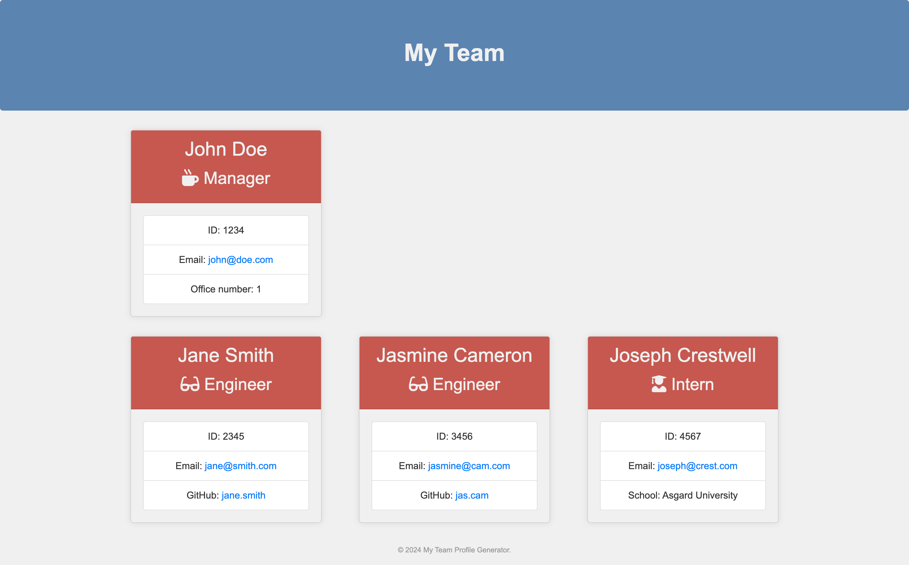

# teamProfileGeneratorNode

This is the README file for the password Team Profile Generater. It provides information about the project, how to get to it, and any other relevant details.

## Table of Contents

- [Description](#description)
- [Features](#features)
- [Installation](#installation)
- [Usage](#usage)
- [Technologies Used](#technologies-used)
- [License](#license)
- [Acknowledgments](#acknowledgments)
- [Contact](#contact)

## Description

The Team Profile Generator is a Node.js command-line application designed to help managers and team leads quickly generate a webpage that displays the essential information of their software engineering team members. By collecting information about employees through a user-friendly command-line interface, the application outputs an HTML webpage showcasing summaries for each team member, including their names, email addresses, and GitHub profiles. This tool aims to facilitate access to team members' contact information and professional profiles, streamlining communication and collaboration within teams.

## Features

- A command-line application that accepts user input about software engineering team members.
- Utilizes Inquirer for collecting input from the user.
- Classes for each team member (Manager, Engineer, Intern) with specific properties and methods, extending from an Employee parent class.
- Jest is used for running provided unit tests, ensuring all parts of the code pass.
- Generates an HTML webpage that displays summaries for each team member, including names, emails, and GitHub profiles.

## Installation

1. Setup and Initialization:

- Ensure Node.js is installed on your system.
- Clone the repository and navigate to the project directory.
- Install dependencies by running npm install, you will need:
  - inquirer
  - jest
  - path
  - fs/promises

## Usage

1. Running the Application:

- Invoke the application using the command node index.js in your terminal.
- Follow the prompts to enter the team manager’s details (Name, Employee ID, Email address, Office number).
- Choose to add an engineer or an intern, or finish building the team.

You can add as many team members as you like. Once finished, select the option to complete the team setup.

2. Output:

Upon completion, the application generates an HTML file named team.html in the output folder, showcasing the team profiles.
Validation.

The generated HTML webpage should look something like this:

A sample of the HTML file here: https://github.com/jennysiu/teamProfileGeneratorNode/blob/main/assets/sampleHTML/team.html

## Technologies Used

- Node.js
- Inquirer.js
- Jest
- JavaScript
- HTML5
- CSS3

## License

MIT License

Copyright (c) [2023] [Jenny Siu]

Permission is hereby granted, free of charge, to any person obtaining a copy of this software and associated documentation files (the "Software"), to deal in the Software without restriction, including without limitation the rights to use, copy, modify, merge, publish, distribute, sublicense, and/or sell copies of the Software, and to permit persons to whom the Software is furnished to do so, subject to the following conditions:

The above copyright notice and this permission notice shall be included in all copies or substantial portions of the Software.

THE SOFTWARE IS PROVIDED "AS IS", WITHOUT WARRANTY OF ANY KIND, EXPRESS OR IMPLIED, INCLUDING BUT NOT LIMITED TO THE WARRANTIES OF MERCHANTABILITY, FITNESS FOR A PARTICULAR PURPOSE AND NONINFRINGEMENT. IN NO EVENT SHALL THE AUTHORS OR COPYRIGHT HOLDERS BE LIABLE FOR ANY CLAIM, DAMAGES OR OTHER LIABILITY, WHETHER IN AN ACTION OF CONTRACT, TORT OR OTHERWISE, ARISING FROM, OUT OF OR IN CONNECTION WITH THE SOFTWARE OR THE USE OR OTHER DEALINGS IN THE SOFTWARE.

## Acknowledgments
- README template inspired by ChatGPT, an AI language model developed by OpenAI.
  (Note: portions of this README were generated with assistance from ChatGPT.)

## Contact
Feel free to reach out to me if you have any questions or feedback.

Jenny Siu | 
[Email](jenny.siu79@gmail.com) |
[LinkedIn](https://www.linkedin.com/in/jenny-siu-534576156/)